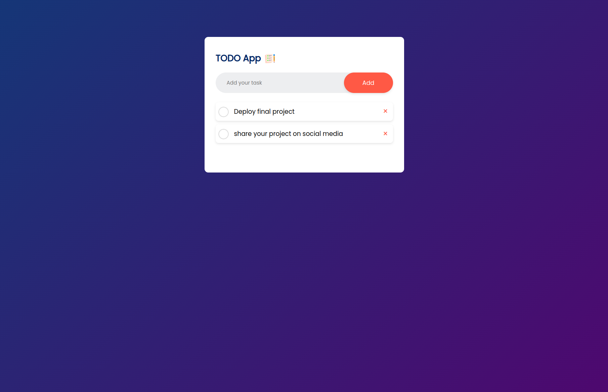

# MERN Full-Stack To-Do Application

Welcome to the **Full-Stack To-Do Application**! 🎉 This project is a complete to-do list application built using the MERN stack (MongoDB, Express.js, React, and Node.js) with Zod for validation. It allows users to create, update, delete, and view tasks efficiently.

## 🖼️ Preview

## 🚀 Features

- **Add New Tasks**: Create new tasks with a simple interface.
- **Mark Tasks as Completed**: Toggle the completion status of tasks.
- **Delete Tasks**: Remove tasks from your list.
- **Responsive Design**: Optimized for both desktop and mobile devices.

## 🛠️ Technologies Used

- **Frontend**: React.js
- **Backend**: Node.js, Express.js
- **Database**: MongoDB
- **Validation**: Zod
- **Styling**: Custom CSS
